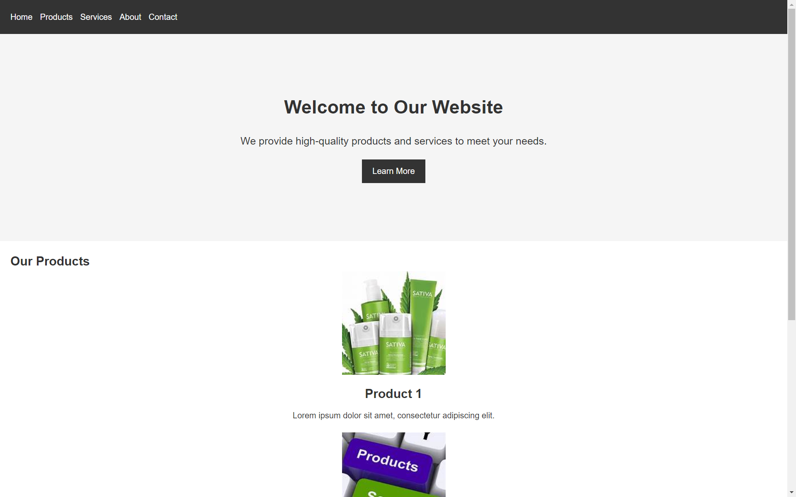

# Exp-2 Create a commercial website using HTML & CSS

## AIM:
To create a commercial website using HTML & CSS.

## PROCEDURE:
STEP 1:
Create basic outline for website using html.

STEP 2:
Create style part of the website using css.

STEP 3:
Link the css file with html code using link tag

STEP 4:
Run the code and check the webpage in an web browser.

## PROGRAM:
### HTML:
```html
<!DOCTYPE html>
<html>
<head>
  <title>My Commercial Website</title>
  <link rel="stylesheet" href="styles.css">
</head>
<body>
  <header>
    <nav>
      <ul>
        <li><a href="#">Home</a></li>
        <li><a href="#">Products</a></li>
        <li><a href="#">Services</a></li>
        <li><a href="#">About</a></li>
        <li><a href="#">Contact</a></li>
      </ul>
    </nav>
  </header>

  <section id="hero">
    <div class="hero-content">
      <h1>Welcome to Our Website</h1>
      <p>We provide high-quality products and services to meet your needs.</p>
      <a href="#" class="btn">Learn More</a>
    </div>
  </section>

  <section id="products">
    <h2>Our Products</h2>
    <div class="product">
      
      <h3>Product 1</h3>
      <p>Lorem ipsum dolor sit amet, consectetur adipiscing elit.</p>
    </div>
    <div class="product">
      
      <h3>Product 2</h3>
      <p>Aliquam eu dolor quis velit interdum aliquet.</p>
    </div>
  </section>

  <section id="services">
    <h2>Our Services</h2>
    <div class="service">
      <h3>Service 1</h3>
      <p>Lorem ipsum dolor sit amet, consectetur adipiscing elit.</p>
    </div>
    <div class="service">
      <h3>Service 2</h3>
      <p>Aliquam eu dolor quis velit interdum aliquet.</p>
    </div>
  </section>

  <footer>
    <p>&copy; 2023 My Commercial Website. All rights reserved.</p>
  </footer>
</body>
</html>
```
### CSS:
```css
/* styles.css */

/* Reset default margins and paddings */
body, h1, h2, h3, ul, p {
  margin: 0;
  padding: 0;
}

/* Set body background color and font styles */
body {
  background-color: #f5f5f5;
  font-family: Arial, sans-serif;
  font-size: 16px;
  line-height: 1.6;
  color: #333;
}

/* Style header section */
header {
  background-color: #333;
  padding: 20px;
  color: #fff;
}

/* Style navigation menu */
nav ul {
  list-style-type: none;
}

nav ul li {
  display: inline-block;
  margin-right: 10px;
}

nav ul li a {
  color: #fff;
  text-decoration: none;
}

nav ul li a:hover {
  text-decoration: underline;
}

/* Style hero section */
#hero {
  background-image: url('hero-bg.jpg');
  background-size: cover;
  background-position: center;
  height: 400px;
  display: flex;
  justify-content: center;
  align-items: center;
}

.hero-content {
  text-align: center;
}

.hero-content h1 {
  font-size: 36px;
  margin-bottom: 20px;
}

.hero-content p {
  font-size: 20px;
  margin-bottom: 20px;
}

.btn {
  display: inline-block;
  background-color: #333;
  color: #fff;
  padding: 10px 20px;
  text-decoration: none;
}

.btn:hover {
  background-color: #555;
}

/* Style products section */
#products {
  background-color: #fff;
  padding: 20px;
}

.product {
  text-align: center;
  margin-bottom: 20px;
}

.product img {
  width: 200px;
  height: 200px;
  object-fit: cover;
  margin-bottom: 10px;
}

.product h3 {
  font-size: 24px;
  margin-bottom: 10px;
}

.product p {
  font-size: 16px;
}

/* Style services section */
#services {
  background-color: #f5f5f5;
  padding: 20px;
}

.service {
  margin-bottom: 20px;
}

.service h3 {
  font-size: 24px;
  margin-bottom: 10px;
}

.service p {
  font-size: 16px;
}

/* Style footer section */
footer {
  background-color: #333;
  padding: 10px;
  color: #fff;
  text-align: center;
}
```
## OUTPUT:


## RESULT:
Thus a commercial website using HTML & CSS has been created and output verified sucessfully


